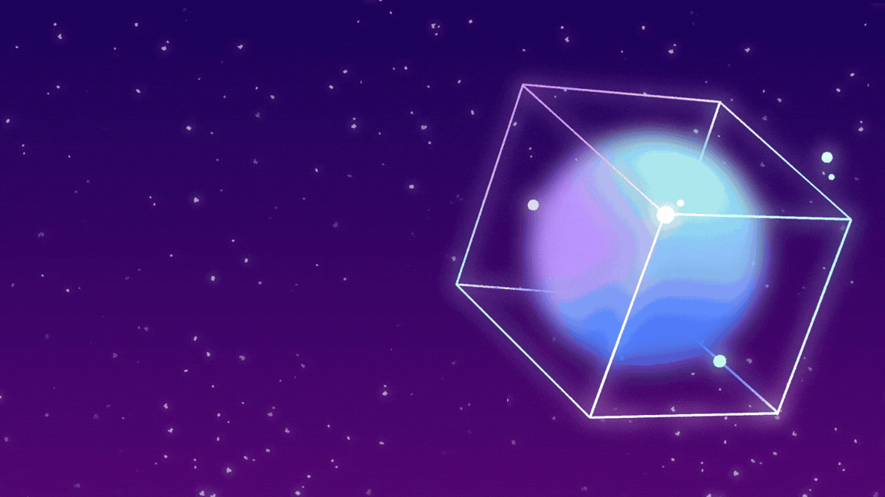

<!-- ═══════════════════════════════════════════════════════════════ -->
<!--  BANNER GIF                                                   -->
<!-- ═══════════════════════════════════════════════════════════════ -->

  

<!-- ═══════════════════════════════════════════════════════════════ -->
<!--  ANIMATED SVG BANNER (Theme-Aware)                            -->
<!-- ═══════════════════════════════════════════════════════════════ -->
<picture>
  <source media="(prefers-color-scheme: dark)" srcset="./profile-banner-dark.svg?v=3">
  <source media="(prefers-color-scheme: light)" srcset="./profile-banner-light.svg?v=3">
  
</picture>

 

<!-- ═══════════════════════════════════════════════════════════════ -->
<!--  LANYARD ID BADGE + PROJECTS TABLE                            -->
<!-- ═══════════════════════════════════════════════════════════════ -->

<table align="center" border="0">
<tr>
<td width="40%" align="center" valign="middle">

<!-- 🪪 Swinging Lanyard ID Card (3D Glossy, Blue & Lavender, Interactive) -->

</td>
<td width="60%" valign="middle">

### 🚀 Selected Work & Endeavors

| 🎯 Project | 💻 Tech | ⚡ Focus |
|:---|:---:|:---|
| [UNICEF Data Cleaning Portal](https://github.com/Aniket-Das-2006) | `Python` `Pandas` `KNIME` | 10,000+ node data pipeline |
| [FitTrack AI Web App](https://github.com/Aniket-Das-2006) | `React` `Vite` `Tailwind` | Dynamic wellness dashboard |
| [Parallax WebGL Canvas](https://github.com/Aniket-Das-2006) | `Three.js` `GSAP` `WebGL` | Interactive 3D visual system |
| [Macro-Economic Study](https://github.com/Aniket-Das-2006) | `Tableau` `StatsModels` | Monetary policy analysis |
| [Zomato Geo-Distribution](https://github.com/Aniket-Das-2006) | `Tableau` `Matplotlib` | Urban cluster spatial analysis |

 

> 💙 *"I don't just write code, I orchestrate digital realities."*

</td>
</tr>
</table>

 

---

 

<!-- ═══════════════════════════════════════════════════════════════ -->
<!--  GITHUB STATS (Side by Side, Matching Blue & Lavender Theme)  -->
<!-- ═══════════════════════════════════════════════════════════════ -->

 

<!-- ═══════════════════════════════════════════════════════════════ -->
<!--  STREAK STATS                                                 -->
<!-- ═══════════════════════════════════════════════════════════════ -->

 

<!-- ═══════════════════════════════════════════════════════════════ -->
<!--  CONTRIBUTION GRAPH                                           -->
<!-- ═══════════════════════════════════════════════════════════════ -->

 

---

 

<!-- ═══════════════════════════════════════════════════════════════ -->
<!--  TROPHIES                                                     -->
<!-- ═══════════════════════════════════════════════════════════════ -->

 

---

 

<!-- ═══════════════════════════════════════════════════════════════ -->
<!--  CONTRIBUTION SNAKE                                           -->
<!-- ═══════════════════════════════════════════════════════════════ -->

<picture>
  <source media="(prefers-color-scheme: dark)" srcset="https://raw.githubusercontent.com/Aniket-Das-2006/Aniket-Das-2006/output/github-contribution-grid-snake-dark.svg">
  <source media="(prefers-color-scheme: light)" srcset="https://raw.githubusercontent.com/Aniket-Das-2006/Aniket-Das-2006/output/github-contribution-grid-snake.svg">
  
</picture>

 

---

 

<!-- ═══════════════════════════════════════════════════════════════ -->
<!--  OCTOCAT PAINTER LOOP                                         -->
<!-- ═══════════════════════════════════════════════════════════════ -->

 

Stroke-dashoffset vector animation · GitHub Octocat · Infinite loop

 

---

 

<!-- ═══════════════════════════════════════════════════════════════ -->
<!--  TECH STACK BADGES                                            -->
<!-- ═══════════════════════════════════════════════════════════════ -->

 

---

 

<!-- ═══════════════════════════════════════════════════════════════ -->
<!--  PROFILE BADGES + VIEWS                                       -->
<!-- ═══════════════════════════════════════════════════════════════ -->

  

  

 

<!-- ═══════════════════════════════════════════════════════════════ -->
<!--  FOOTER                                                       -->
<!-- ═══════════════════════════════════════════════════════════════ -->

