<div align="center">

<!-- ═══════════════════════════════════════════════════════════════ -->
<!-- 🎬  GIT BANNER GIF AT THE VERY TOP                           -->
<!-- ═══════════════════════════════════════════════════════════════ -->


<br/><br/>

<!-- ═══════════════════════════════════════════════════════════════ -->
<!-- ✨  ANIMATED THEME-AWARE SVG BANNER                          -->
<!-- ═══════════════════════════════════════════════════════════════ -->
<picture>
  <source media="(prefers-color-scheme: dark)" srcset="./profile-banner-dark.svg">
  <source media="(prefers-color-scheme: light)" srcset="./profile-banner-light.svg">
  
</picture>

<br/>

<!-- ═══════════════════════════════════════════════════════════════ -->
<!-- 🌟 NEON GLOWING TYPING SVG                                    -->
<!-- ═══════════════════════════════════════════════════════════════ -->
<a href="https://git.io/typing-svg">
  
</a>

<br/>

<!-- ═══════════════════════════════════════════════════════════════ -->
<!-- 🪪 SHINY STICKER BADGES (Blue & Lavender)                    -->
<!-- ═══════════════════════════════════════════════════════════════ -->


<br/><br/>

<!-- ═══════════════════════════════════════════════════════════════ -->
<!-- 👁️ REAL-TIME PROFILE VIEWS COUNTER                           -->
<!-- ═══════════════════════════════════════════════════════════════ -->


</div>

---

<br/>

<!-- ═══════════════════════════════════════════════════════════════ -->
<!-- 🪪 LANYARD + ABOUT TABLE                                      -->
<!-- ═══════════════════════════════════════════════════════════════ -->

<table align="center" border="0">
<tr>
<td width="38%" align="center" valign="middle">

<!-- 🪪 Swinging Lanyard ID Card -->


</td>
<td width="62%" valign="middle">

### 💎 About Me

```yaml
Name:       Aniket Das
Location:   Berhampore, West Bengal, India
Institute:  IIM Sambalpur (BS Data Science & AI)
Also:       IIT Madras (Foundation Completed)
Interests:  AI Engineering, Empathy Tech, Creative Coding
Passions:   Singing 🎤 | Writing ✍️ | Photography 📸 | Designing 🎨
```

> 💙 *"I don't just write code, I build digital experiences."*

</td>
</tr>
</table>

<br/>

---

<br/>

<!-- ═══════════════════════════════════════════════════════════════ -->
<!-- 🧩 TECH STACK (Neon Glowing Stickers)                         -->
<!-- ═══════════════════════════════════════════════════════════════ -->

<div align="center">

### 🧩 Tech Stack & Tools

<br/>


</div>

<br/>

---

<br/>

<!-- ═══════════════════════════════════════════════════════════════ -->
<!-- 📊 REAL-TIME GITHUB STATS & GRAPHS (Blue/Lavender theme)      -->
<!-- ═══════════════════════════════════════════════════════════════ -->

<div align="center">

### 📊 GitHub Stats & Graphs

<br/>

<!-- Stats Card -->

&nbsp;
<!-- Top Languages -->


<br/><br/>

<!-- Streak Stats -->


<br/><br/>

<!-- Contribution Graph -->


</div>

<br/>

---

<br/>

<!-- ═══════════════════════════════════════════════════════════════ -->
<!-- 🏆 ACHIEVEMENTS & TROPHIES                                    -->
<!-- ═══════════════════════════════════════════════════════════════ -->

<div align="center">

### 🏆 GitHub Trophies

<br/>


</div>

<br/>

---

<br/>

<!-- ═══════════════════════════════════════════════════════════════ -->
<!-- 🐍 SNAKE CONTRIBUTION ANIMATION                               -->
<!-- ═══════════════════════════════════════════════════════════════ -->

<div align="center">

### 🐍 Watch the Snake Eat My Contributions

<br/>

<picture>
  <source media="(prefers-color-scheme: dark)" srcset="https://raw.githubusercontent.com/platane/snk/output/github-contribution-grid-snake-dark.svg">
  <source media="(prefers-color-scheme: light)" srcset="https://raw.githubusercontent.com/platane/snk/output/github-contribution-grid-snake.svg">
  
</picture>

</div>

<br/>

---

<br/>

<!-- ═══════════════════════════════════════════════════════════════ -->
<!-- 🎨 OCTOCAT PAINTER LOOP (Draw & Erase)                        -->
<!-- ═══════════════════════════════════════════════════════════════ -->

<div align="center">

### 🎨 Octocat Painter Loop

<p style="color: #94a3b8; font-size: 0.9rem;">Watch as a neon painter draws the GitHub Octocat logo, then erases it — in an infinite loop.</p>

<br/>


</div>

<br/>

---

<br/>

<!-- ═══════════════════════════════════════════════════════════════ -->
<!-- 🚀 FEATURED PROJECTS                                          -->
<!-- ═══════════════════════════════════════════════════════════════ -->

<div align="center">

### 🚀 Featured Projects

</div>

<br/>

| 💻 Project | 🛠️ Tech Stack | 📝 Description |
|:---|:---:|:---|
| **UNICEF Data Cleaning Portal** | `Python` `Pandas` `KNIME` `Excel` | Formulated data cleansing matrices for school auditing logs across 10,000+ data nodes |
| **FitTrack AI Web App UI** | `React` `CSS Grid` `Tailwind` `Vite` | High-fidelity wellness tracker interface with animated progress meters |
| **Dynamic Parallax Canvas** | `React` `Three.js` `GSAP` `WebGL` | WebGL particle systems with real-time mouse repulsion loops |
| **Macro-Economic Trends Study** | `Research` `Tableau` `StatsModels` | Quantitative policy assessments on monetary flows & growth indicators |
| **Zomato Consumer Distribution** | `Tableau` `Matplotlib` `RapidMiner` | Consumer delivery clusters and geo-mapping outputs for urban segments |

<br/>

---

<br/>

<!-- ═══════════════════════════════════════════════════════════════ -->
<!-- 🎮 INTERACTIVE DASHBOARD (hosted separately)                  -->
<!-- ═══════════════════════════════════════════════════════════════ -->

<div align="center">

### 🎮 Interactive Dashboard & Arcade

> 🕹️ **Neon Breakout** & **Neon Snake** • 🌐 **Live World Clocks** • 🌤️ **Real-Time Weather (Berhampore)** • 📅 **Calendar**
>
> *All powered by a custom React + Vite dashboard app included in the `dashboard/` folder of this repo.*
>
> To run locally:
> ```bash
> cd dashboard && npm install && npm run dev
> ```

</div>

<br/>

---

<br/>

<!-- ═══════════════════════════════════════════════════════════════ -->
<!-- 📬 LET'S CONNECT (Shiny badges)                               -->
<!-- ═══════════════════════════════════════════════════════════════ -->

<div align="center">

### 📬 Let's Connect

<br/>

<a href="mailto:bsdsai25aniketd@iimsambalpur.ac.in">
  
</a>
<a href="https://www.linkedin.com/in/aniket-das-921b24334/" target="_blank">
  
</a>
<a href="https://github.com/" target="_blank">
  
</a>

<br/><br/>

<!-- ═══════════════════════════════════════════════════════════════ -->
<!-- ⭐ FOOTER QUOTE                                               -->
<!-- ═══════════════════════════════════════════════════════════════ -->


</div>
